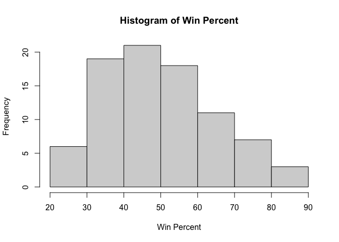
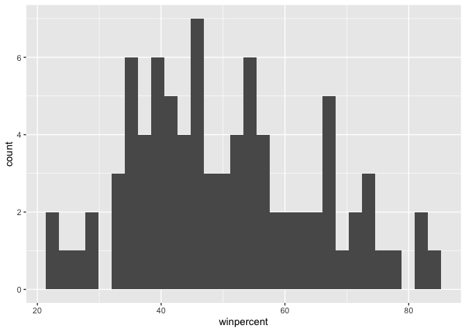
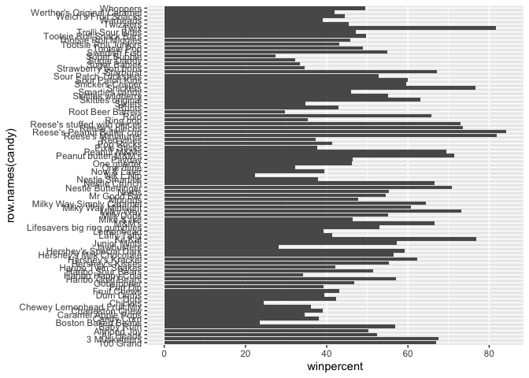
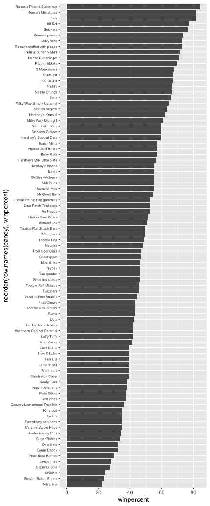
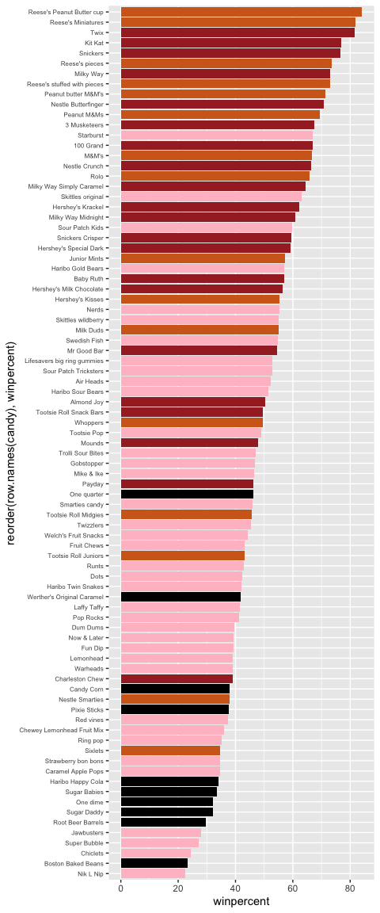
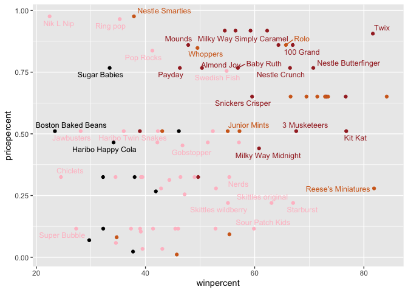
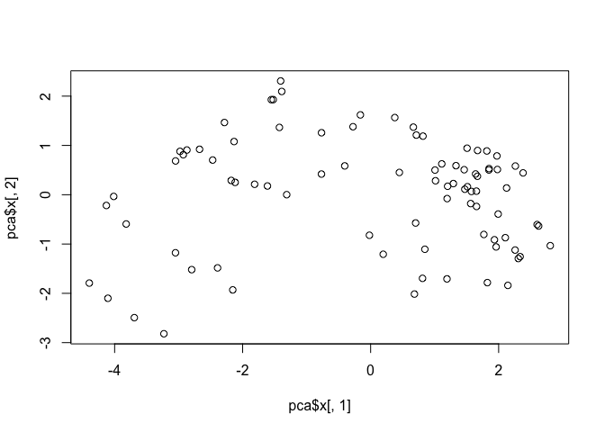
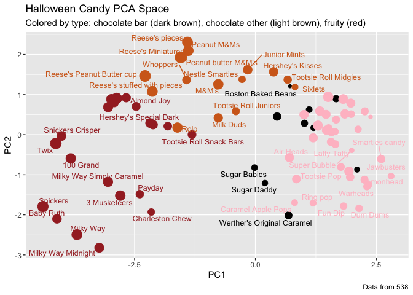

# Candy Mini project
Sahar kamali

\##Importing Data

``` r
candy_file <- "candy-data.csv"
candy <- read.csv(candy_file, row.names = 1)
head(candy)
```

                 chocolate fruity caramel peanutyalmondy nougat crispedricewafer
    100 Grand            1      0       1              0      0                1
    3 Musketeers         1      0       0              0      1                0
    One dime             0      0       0              0      0                0
    One quarter          0      0       0              0      0                0
    Air Heads            0      1       0              0      0                0
    Almond Joy           1      0       0              1      0                0
                 hard bar pluribus sugarpercent pricepercent winpercent
    100 Grand       0   1        0        0.732        0.860   66.97173
    3 Musketeers    0   1        0        0.604        0.511   67.60294
    One dime        0   0        0        0.011        0.116   32.26109
    One quarter     0   0        0        0.011        0.511   46.11650
    Air Heads       0   0        0        0.906        0.511   52.34146
    Almond Joy      0   1        0        0.465        0.767   50.34755

\##What is the data set

> Q1. How many different candy types are in this dataset?

``` r
nrow(candy)
```

    [1] 85

> Q2. How many fruity candy types are in the dataset?

``` r
sum(candy$fruity == 1)
```

    [1] 38

\##What’s my favorite candy

> Q3. What is your favorite candy (other than Twix) in the dataset and
> what is it’s winpercent value?

``` r
candy[order(-candy$winpercent), ][1:10, "winpercent"]
```

     [1] 84.18029 81.86626 81.64291 76.76860 76.67378 73.43499 73.09956 72.88790
     [9] 71.46505 70.73564

``` r
candy["Reese's Peanut Butter cup", ]$winpercent
```

    [1] 84.18029

> Q4. What is the winpercent value for “Kit Kat”?

``` r
candy["Kit Kat", ]$winpercent
```

    [1] 76.7686

> Q5. What is the winpercent value for “Tootsie Roll Snack Bars”?

``` r
candy["Tootsie Roll Snack Bars", ]$winpercent
```

    [1] 49.6535

``` r
library(skimr)
```

    Warning: package 'skimr' was built under R version 4.5.2

``` r
skim(candy)
```

|                                                  |       |
|:-------------------------------------------------|:------|
| Name                                             | candy |
| Number of rows                                   | 85    |
| Number of columns                                | 12    |
| \_\_\_\_\_\_\_\_\_\_\_\_\_\_\_\_\_\_\_\_\_\_\_   |       |
| Column type frequency:                           |       |
| numeric                                          | 12    |
| \_\_\_\_\_\_\_\_\_\_\_\_\_\_\_\_\_\_\_\_\_\_\_\_ |       |
| Group variables                                  | None  |

Data summary

**Variable type: numeric**

| skim_variable | n_missing | complete_rate | mean | sd | p0 | p25 | p50 | p75 | p100 | hist |
|:---|---:|---:|---:|---:|---:|---:|---:|---:|---:|:---|
| chocolate | 0 | 1 | 0.44 | 0.50 | 0.00 | 0.00 | 0.00 | 1.00 | 1.00 | ▇▁▁▁▆ |
| fruity | 0 | 1 | 0.45 | 0.50 | 0.00 | 0.00 | 0.00 | 1.00 | 1.00 | ▇▁▁▁▆ |
| caramel | 0 | 1 | 0.16 | 0.37 | 0.00 | 0.00 | 0.00 | 0.00 | 1.00 | ▇▁▁▁▂ |
| peanutyalmondy | 0 | 1 | 0.16 | 0.37 | 0.00 | 0.00 | 0.00 | 0.00 | 1.00 | ▇▁▁▁▂ |
| nougat | 0 | 1 | 0.08 | 0.28 | 0.00 | 0.00 | 0.00 | 0.00 | 1.00 | ▇▁▁▁▁ |
| crispedricewafer | 0 | 1 | 0.08 | 0.28 | 0.00 | 0.00 | 0.00 | 0.00 | 1.00 | ▇▁▁▁▁ |
| hard | 0 | 1 | 0.18 | 0.38 | 0.00 | 0.00 | 0.00 | 0.00 | 1.00 | ▇▁▁▁▂ |
| bar | 0 | 1 | 0.25 | 0.43 | 0.00 | 0.00 | 0.00 | 0.00 | 1.00 | ▇▁▁▁▂ |
| pluribus | 0 | 1 | 0.52 | 0.50 | 0.00 | 0.00 | 1.00 | 1.00 | 1.00 | ▇▁▁▁▇ |
| sugarpercent | 0 | 1 | 0.48 | 0.28 | 0.01 | 0.22 | 0.47 | 0.73 | 0.99 | ▇▇▇▇▆ |
| pricepercent | 0 | 1 | 0.47 | 0.29 | 0.01 | 0.26 | 0.47 | 0.65 | 0.98 | ▇▇▇▇▆ |
| winpercent | 0 | 1 | 50.32 | 14.71 | 22.45 | 39.14 | 47.83 | 59.86 | 84.18 | ▃▇▆▅▂ |

> Q6. Is there any variable/column that looks to be on a different scale
> to the majority of the other columns in the dataset?

Yes, winpercent, sugarpercent, and pricepercent are on a continuous
scale, unlike most binary columns.

> Q7. What do you think a zero and one represent for the
> candy\$chocolate column?

0 means it does not contain chocolate 1 means it contains chocolate

\##Exploratory Analysis

> Q8.Plot a histogram of winpercent values using both base R an ggplot2.

``` r
hist(candy$winpercent,
     main="Histogram of Win Percent",
     xlab="Win Percent")
```



``` r
library(ggplot2)
```

    Warning: package 'ggplot2' was built under R version 4.5.2

``` r
ggplot(candy, aes(x = winpercent)) +
  geom_histogram()
```

    `stat_bin()` using `bins = 30`. Pick better value `binwidth`.



> Q9. Is the distribution of winpercent values symmetrical?

Roughly bell-shaped with slight skew.

> Q10. Is the center of the distribution above or below 50%?

``` r
mean(candy$winpercent)
```

    [1] 50.31676

Just a little above 50%.

> Q11. On average is chocolate candy higher or lower ranked than fruit
> candy?

``` r
tapply(candy$winpercent, candy$chocolate, mean)
```

           0        1 
    42.14226 60.92153 

chocolate candy is ranked higher (60) than fruit candy(42).

> Q12. Is this difference statistically significant?

``` r
t.test(winpercent ~ chocolate, data = candy)
```


        Welch Two Sample t-test

    data:  winpercent by chocolate
    t = -7.3031, df = 67.539, p-value = 4.164e-10
    alternative hypothesis: true difference in means between group 0 and group 1 is not equal to 0
    95 percent confidence interval:
     -23.91110 -13.64744
    sample estimates:
    mean in group 0 mean in group 1 
           42.14226        60.92153 

Yes, the difference is statistically significant.

\##Overal Candy Rankings

> Q13. What are the five least liked candy types in this set?

``` r
head(candy[order(candy$winpercent), ], 5)
```

                       chocolate fruity caramel peanutyalmondy nougat
    Nik L Nip                  0      1       0              0      0
    Boston Baked Beans         0      0       0              1      0
    Chiclets                   0      1       0              0      0
    Super Bubble               0      1       0              0      0
    Jawbusters                 0      1       0              0      0
                       crispedricewafer hard bar pluribus sugarpercent pricepercent
    Nik L Nip                         0    0   0        1        0.197        0.976
    Boston Baked Beans                0    0   0        1        0.313        0.511
    Chiclets                          0    0   0        1        0.046        0.325
    Super Bubble                      0    0   0        0        0.162        0.116
    Jawbusters                        0    1   0        1        0.093        0.511
                       winpercent
    Nik L Nip            22.44534
    Boston Baked Beans   23.41782
    Chiclets             24.52499
    Super Bubble         27.30386
    Jawbusters           28.12744

> Q14. What are the top 5 all time favorite candy types out of this set?

``` r
head(candy[order(-candy$winpercent), ], 5)
```

                              chocolate fruity caramel peanutyalmondy nougat
    Reese's Peanut Butter cup         1      0       0              1      0
    Reese's Miniatures                1      0       0              1      0
    Twix                              1      0       1              0      0
    Kit Kat                           1      0       0              0      0
    Snickers                          1      0       1              1      1
                              crispedricewafer hard bar pluribus sugarpercent
    Reese's Peanut Butter cup                0    0   0        0        0.720
    Reese's Miniatures                       0    0   0        0        0.034
    Twix                                     1    0   1        0        0.546
    Kit Kat                                  1    0   1        0        0.313
    Snickers                                 0    0   1        0        0.546
                              pricepercent winpercent
    Reese's Peanut Butter cup        0.651   84.18029
    Reese's Miniatures               0.279   81.86626
    Twix                             0.906   81.64291
    Kit Kat                          0.511   76.76860
    Snickers                         0.651   76.67378

> Q15. Make a first barplot of candy ranking based on winpercent values.

``` r
ggplot(candy, aes(x = row.names(candy), y = winpercent)) +
  geom_col() +
  coord_flip()
```



> Q16. This is quite ugly, use the reorder() function to get the bars
> sorted by winpercent?

``` r
ggplot(candy, aes(x = reorder(row.names(candy), winpercent), y = winpercent)) +
  geom_col() +
  coord_flip() +
  theme(axis.text.y = element_text(size = 6))
```



\##Time to add color

``` r
my_cols <- rep("black", nrow(candy))

my_cols[as.logical(candy$chocolate)] <- "chocolate"
my_cols[as.logical(candy$bar)] <- "brown"
my_cols[as.logical(candy$fruity)] <- "pink"
```

``` r
ggplot(candy) +
  aes(winpercent, reorder(row.names(candy), winpercent)) +
  geom_col(fill = my_cols) +
  theme(axis.text.y = element_text(size = 6))
```



``` r
head(candy[candy$chocolate == 1, ][order(candy[candy$chocolate == 1, ]$winpercent), ], 1)
```

            chocolate fruity caramel peanutyalmondy nougat crispedricewafer hard
    Sixlets         1      0       0              0      0                0    0
            bar pluribus sugarpercent pricepercent winpercent
    Sixlets   0        1         0.22        0.081     34.722

> Q17. What is the worst ranked chocolate candy?

Sixlets is ranked the worst chocolate candy.

> Q18. What is the best ranked fruity candy?

``` r
head(candy[candy$fruity == 1, ][order(-candy[candy$fruity == 1, ]$winpercent), ], 1)
```

              chocolate fruity caramel peanutyalmondy nougat crispedricewafer hard
    Starburst         0      1       0              0      0                0    0
              bar pluribus sugarpercent pricepercent winpercent
    Starburst   0        1        0.151         0.22   67.03763

Starburst is ranked the best fruity candy.

\##Taking a look at pricepercent

``` r
library(ggrepel)

ggplot(candy) +
  aes(x = winpercent, y = pricepercent, label = row.names(candy)) +
  geom_point(col = my_cols) +
  geom_text_repel(col = my_cols, size = 3.3, max.overlaps = 5)
```

    Warning: ggrepel: 50 unlabeled data points (too many overlaps). Consider
    increasing max.overlaps



> Q19. Which candy type is the highest ranked in terms of winpercent for
> the least money - i.e. offers the most bang for your buck?

``` r
best_value <- candy[order(candy$pricepercent, -candy$winpercent), ][1, ]
best_value
```

                         chocolate fruity caramel peanutyalmondy nougat
    Tootsie Roll Midgies         1      0       0              0      0
                         crispedricewafer hard bar pluribus sugarpercent
    Tootsie Roll Midgies                0    0   0        1        0.174
                         pricepercent winpercent
    Tootsie Roll Midgies        0.011   45.73675

``` r
row.names(best_value)
```

    [1] "Tootsie Roll Midgies"

> Q20. What are the top 5 most expensive candy types in the dataset and
> of these which is the least popular?

``` r
top5_expensive <- candy[order(-candy$pricepercent), ][1:5, c("pricepercent","winpercent")]
top5_expensive
```

                             pricepercent winpercent
    Nik L Nip                       0.976   22.44534
    Nestle Smarties                 0.976   37.88719
    Ring pop                        0.965   35.29076
    Hershey's Krackel               0.918   62.28448
    Hershey's Milk Chocolate        0.918   56.49050

The top 5 most expensive candies are Nik L Nip, Nestle Smarties, Ring
pop, Hershey’s Krackel, and Hershey’s Milk Chocolate.

``` r
least_popular_of_top5 <- top5_expensive[order(top5_expensive$winpercent), ][1, ]
least_popular_of_top5
```

              pricepercent winpercent
    Nik L Nip        0.976   22.44534

``` r
row.names(least_popular_of_top5)
```

    [1] "Nik L Nip"

Out of the top 5 most expensive candies, “Nik L Nip” is the least
popular.

\##Exploring The Correlation Structure

``` r
library(corrplot)
```

    corrplot 0.95 loaded

``` r
cij <- cor(candy)
corrplot(cij)
```


> Q22. Examining this plot what two variables are anti-correlated
> (i.e. have minus values)?

Chocolate and fruity are anti-correlated.

> Q23. Similarly, what two variables are most positively correlated?

Chocolate and winpercent are the most positively correlated variables.

\##Principal component Analysis

Create PCA

``` r
pca <- prcomp(candy, scale = TRUE)
summary(pca)
```

    Importance of components:
                              PC1    PC2    PC3     PC4    PC5     PC6     PC7
    Standard deviation     2.0788 1.1378 1.1092 1.07533 0.9518 0.81923 0.81530
    Proportion of Variance 0.3601 0.1079 0.1025 0.09636 0.0755 0.05593 0.05539
    Cumulative Proportion  0.3601 0.4680 0.5705 0.66688 0.7424 0.79830 0.85369
                               PC8     PC9    PC10    PC11    PC12
    Standard deviation     0.74530 0.67824 0.62349 0.43974 0.39760
    Proportion of Variance 0.04629 0.03833 0.03239 0.01611 0.01317
    Cumulative Proportion  0.89998 0.93832 0.97071 0.98683 1.00000

Plot PC1 vs PC2

``` r
plot(pca$x[,1], pca$x[,2])
```



Adding Color

``` r
plot(pca$x[,1:2], col = my_cols, pch = 16)
```


``` r
my_data <- cbind(candy, pca$x[,1:3])
```

``` r
p <- ggplot(my_data) +
  aes(x = PC1, y = PC2,
      size = winpercent/100,
      text = rownames(my_data),
      label = rownames(my_data)) +
  geom_point(col = my_cols)

p
```


``` r
library(ggrepel)

p +
  geom_text_repel(size = 3.3, col = my_cols, max.overlaps = 7) +
  theme(legend.position = "none") +
  labs(title = "Halloween Candy PCA Space",
       subtitle = "Colored by type: chocolate bar (dark brown), chocolate other (light brown), fruity (red)",
       caption = "Data from 538")
```

    Warning: ggrepel: 39 unlabeled data points (too many overlaps). Consider
    increasing max.overlaps



``` r
ggplot(pca$rotation) +
  aes(x = PC1, y = rownames(pca$rotation)) +
  geom_col()
```


> Q24. Complete the code to generate the loadings plot above. What
> original variables are picked up strongly by PC1 in the positive
> direction? Do these make sense to you? Where did you see this
> relationship highlighted previously?

PC1 positive is mostly picking up fruity, hard, and pluribus. This makes
sense because candies that are fruity are often hard and often come as
many small pieces in a bag (pluribus). We saw this same pattern earlier
in the correlation plot Section 6. fruity goes together with
hard/pluribus and is opposite of chocolate/bar.

\##Summary

> Q25. Based on your exploratory analysis, correlation findings, and PCA
> results, what combination of characteristics appears to make a
> “winning” candy? How do these different analyses (visualization,
> correlation, PCA) support or complement each other in reaching this
> conclusion?

Winning candies in this dataset are usually chocolate based ones or
often a bar. They sometimes include things like caramel, peanuts, and
almonds. They’re generally not fruity and not hard candy, and they tend
to have the highest winpercent scores. The different analyses all have
the same pattern. The ranking plots show chocolate candies sitting near
the top more often than fruity ones. The correlation plot backs that up
by showing chocolate goes with higher winpercent, while fruity tends to
go the opposite way. The PCA plot basically summarizes this into one
main split, separating chocolate type candies from fruity and hard
candies, and the higher rated candies cluster more on the chocolate
side. So overall, the visuals, correlations, and PCA all support the
same thing that chocolate bar style candies are usually the most likable
candy or winners.
