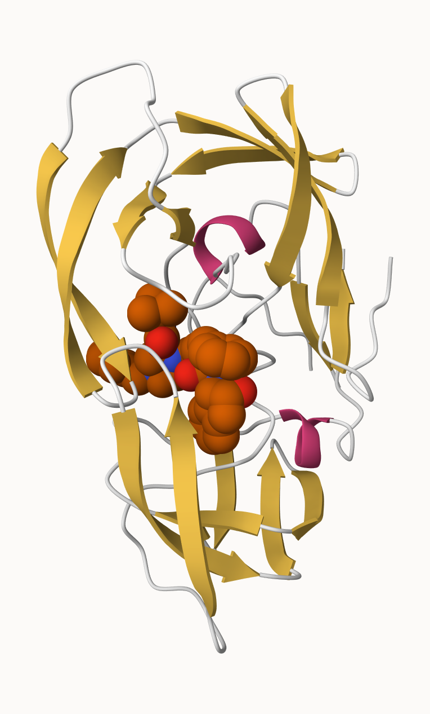
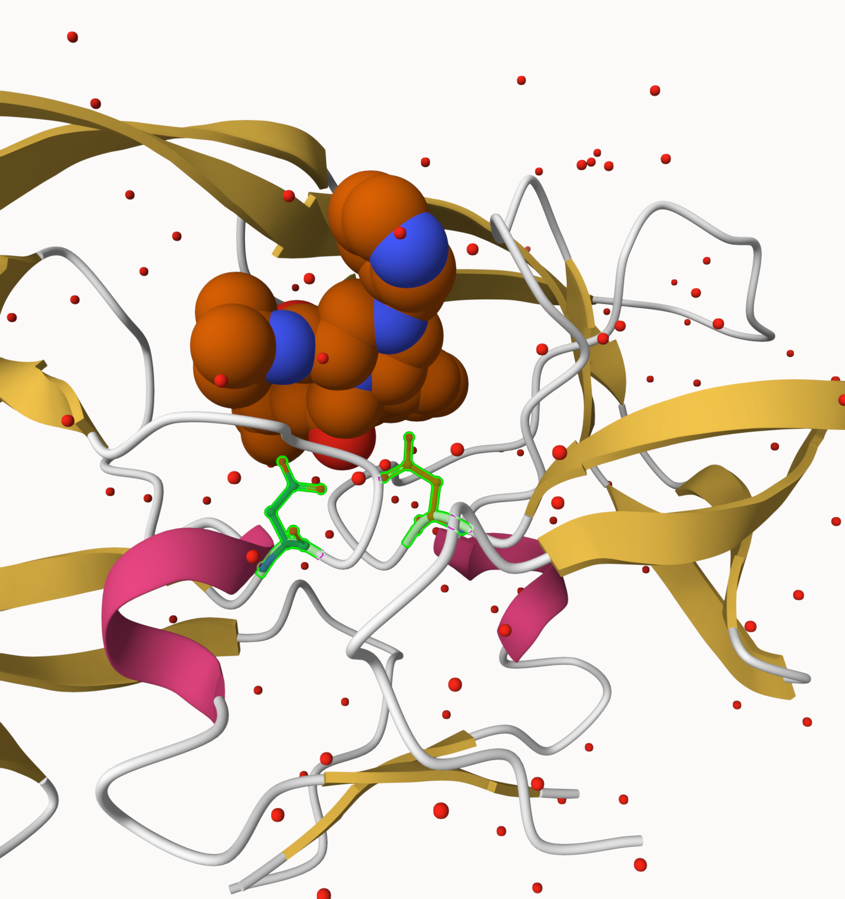
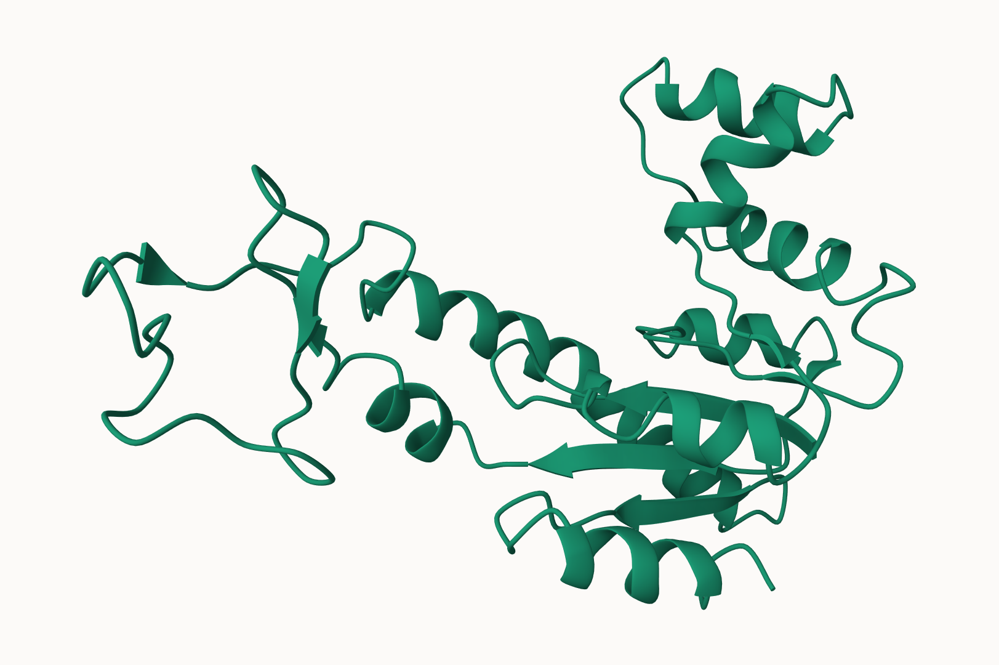
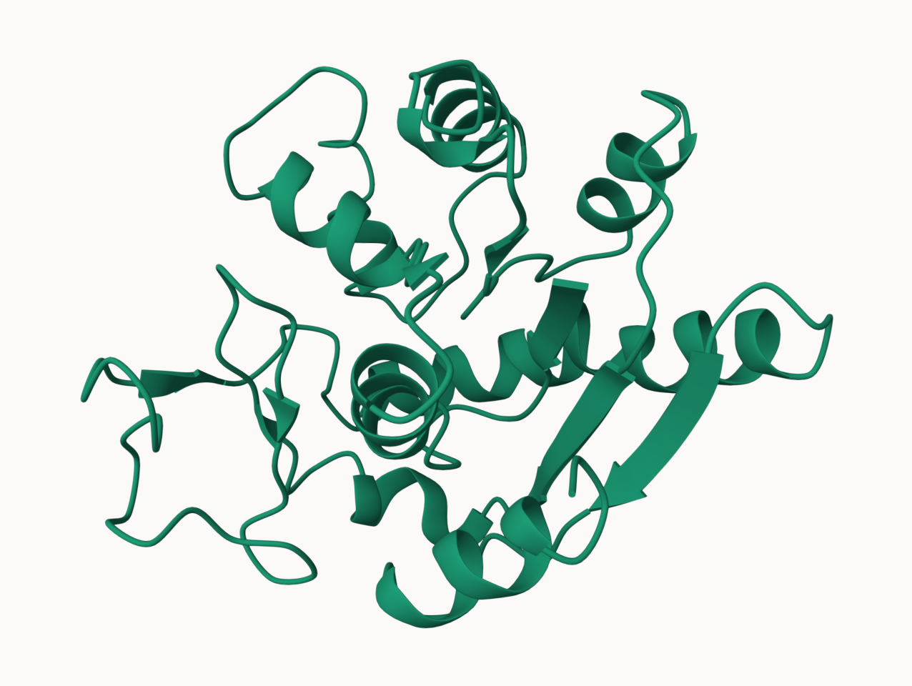

##Introduction to the RCSB Protein Data Bank (PDB)

PDB statistics

```{r}
data <- read.csv("Data Export Summary.csv", stringsAsFactors = FALSE)

#View(data)
```


```{r}
pdb <- read.csv("Data Export Summary.csv")

pdb
```

>Q1: What percentage of structures in the PDB are solved by X-Ray and Electron Microscopy.

```{r}
pdb_num <- pdb
pdb_num[-1] <- lapply(pdb_num[-1], function(x) as.numeric(gsub(",", "", x)))

total <- sum(pdb_num$Total)

xray <- sum(pdb_num$X.ray)

em <- sum(pdb_num$EM)

xray_percent <- xray / total * 100
em_percent <- em / total * 100

xray_percent
em_percent
```


>Q2: What proportion of structures in the PDB are protein?

```{r}
protein_rows <- pdb_num$Molecular.Type %in% c("Protein (only)", "Protein/Oligosaccharide", "Protein/NA")

protein_total <- sum(pdb_num$Total[protein_rows])

protein_percent <- protein_total / total * 100

protein_percent
```


>Q3: Type HIV in the PDB website search box on the home page and determine how many HIV-1 protease structures are in the current PDB?

Searching “HIV-1 protease” on the RCSB PDB homepage returns 1,173 structures. 

##Visualizing the HIV-1 protease structure

Using Mol 
Overall structure of HIV-1 protease (PDB: 1HSG)



Close up of the HIV-1 protease active site highlighting the two catalytic Asp25 residues (one from each chain) shown in green, along with the bound ligand and nearby water molecules.


>Q4: Water molecules normally have 3 atoms. Why do we see just one atom per water molecule in this structure?

In the structure, each water molecule is shown as one atom because X-ray structures usually model only the oxygen atom of water (the hydrogens are not resolved well), so the water appears as a single sphere/point.

>Q5: There is a critical “conserved” water molecule in the binding site. Can you identify this water molecule? What residue number does this water molecule have

The conserved water molecule in the HIV-1 protease active site is associated with the catalytic residue Asp25 (one in each chain).

>Q6: Generate and save a figure clearly showing the two distinct chains of HIV-protease along with the ligand. You might also consider showing the catalytic residues ASP 25 in each chain and the critical water (we recommend “Ball & Stick” for these side-chains). Add this figure to your Quarto document.

see image above. 

##Introduction to Bio3D in R

```{r}

library(bio3d)
```

Reading PDB file data into R

```{r}
pdb <- read.pdb("1hsg")
pdb
```


>Q7: How many amino acid residues are there in this pdb object? 

198

>Q8: Name one of the two non-protein residues?

HOH and MK1 

>Q9: How many protein chains are in this structure? 

2

```{r}
attributes(pdb)
```

```{r}
head(pdb$atom)
```


##Quick PDB visualization in R

```{r}
pak::pak("bioboot/bio3dview")

```


##Predicting functional motions of a single structure

```{r}
adk <- read.pdb("6s36")
adk
```


```{r}
m <- nma(adk)
```


```{r}
plot(m)
```
Normal mode analysis shows that certain regions of adenylate kinase have much higher fluctuations, indicating these residues are more flexible and likely involved in functional motion.

```{r}
mktrj(m, file="adk_m7.pdb")
```


```{r}

```


```{r}
#view.nma(m, pdb=adk)
```


##Comparative structure analysis of Adenylate Kinase

```{r}
library(bio3d)
#library(bio3dview)
library(NGLVieweR)
```

>Q10. Which of the packages above is found only on BioConductor and not CRAN? 

msa

>Q11. Which of the above packages is not found on BioConductor or CRAN?

bio3dbiew

>Q12. True or False? Functions from the pak package can be used to install packages from GitHub and BitBucket?

True 


##Search and retrieve ADK structures


```{r}
library(bio3d)
aa <- get.seq("1ake_A")
aa
```


>Q13. How many amino acids are in this sequence, i.e. how long is this sequence? 

Alignment dimensions: 1 sequence rows; 214 position columns. 

```{r}
hits <- NULL
hits$pdb.id <- c('1AKE_A','6S36_A','6RZE_A','3HPR_A','1E4V_A','5EJE_A','1E4Y_A','3X2S_A','6HAP_A')

```

```{r}
head (hits$pdb.id)
```

```{r}
files <- get.pdb(hits$pdb.id, path="pdbs", split=TRUE, gzip=TRUE)

```

##Align and superpose structures
We need one package from bioConductor. to set this up we need to first install a package called *biocManager**  from CRAN. 

Now we can use the "instal()" function from this package liek this: 
`BiocManager::install("msa")`

```{r}
pdbs <- pdbaln(files, fit=TRUE, exefile="msa")

```

let's have a wee peak at out strucutres after "fitting" or superposing: 

```{r}
#library(bio3dview)

#view.pdbs(pdbs)
```

We can run functions like `rmsd()`, `rmsf()` and the best `pca()`

```{r}
pc.xray <- pca(pdbs)
```


Figure 7: Schematic representation of alignment. Grey regions depict aligned residues, while white depict gap regions. The red bar at the top depict sequence conservation.


##Annotate collected PDB structures

```{r}
ids <- basename.pdb(pdbs$id)

anno <- pdb.annotate(ids)
unique(anno$source)

```

```{r}
anno
```

##Principal component analysis

```{r}
pc.xray <- pca(pdbs)
plot(pc.xray)

```
Figure 9: PCA of adenylate kinase structures. Each dot represents one structure. PC1 explains most of the variance, showing that the main structural differences among adenylate kinase conformations occur along this first principal component.


##RMSD + clustering + color the PCA plot

```{r}
rd <- rmsd(pdbs)

hc.rd <- hclust(dist(rd))
grps.rd <- cutree(hc.rd, k=3)

plot(pc.xray, 1:2, col="purple", bg=grps.rd, pch=21, cex=1)

```
Figure 10: Projection of Adenylate kinase X-ray structures. Each dot represents one PDB structure. 

Finaly let's make a wee movie of the major "motion" or strucutral differences in the dataset - we call this a 

```{r}
mktrj(pc.xray, file="pc_1.pdb") 
```

We can make a visialization of the major conformational differences (i.e. large scale strucutre change)

```{r}
pc1 <- mktrj(pc.xray, pc=1, file="pc_1.pdb")
```



We can also plot our main PCA results with ggplot:

```{r}
library(ggplot2)
library(ggrepel)

df <- data.frame(PC1=pc.xray$z[,1], 
                 PC2=pc.xray$z[,2], 
                 col=as.factor(grps.rd),
                 ids=ids)

p <- ggplot(df) + 
  aes(PC1, PC2, col=col, label=ids) +
  geom_point(size=2) +
  geom_text_repel(max.overlaps = 20) +
  theme(legend.position = "none")
p
```


##Normal mode analysis

```{r}
modes <- nma(pdbs)
```

```{r}
plot(modes, pdbs, col=grps.rd)
```

>Q14. What do you note about this plot? Are the black and colored lines similar or different? Where do you think they differ most and why?

The black and colored lines are mostly similar overall, but they are most different in the big peak region around 130–160 residues and also a smaller difference around 40–60 residues. 
That region shows the highest fluctuations, meaning it’s the most flexible part and likely corresponds to mobile nucleotide binding. 


