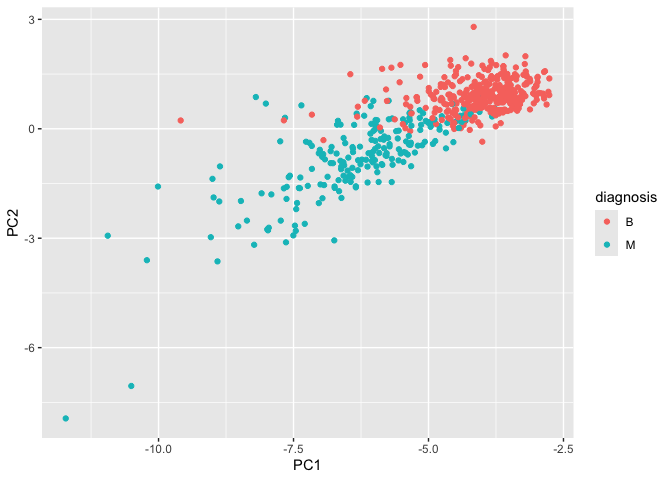
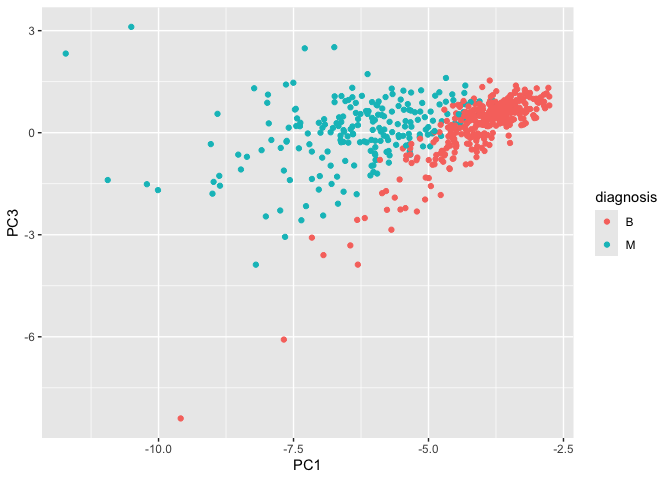
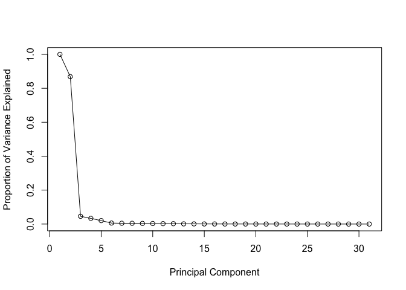
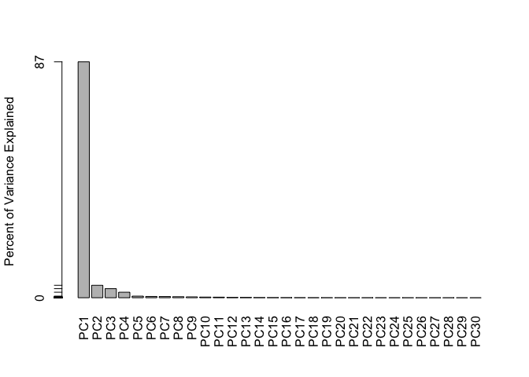
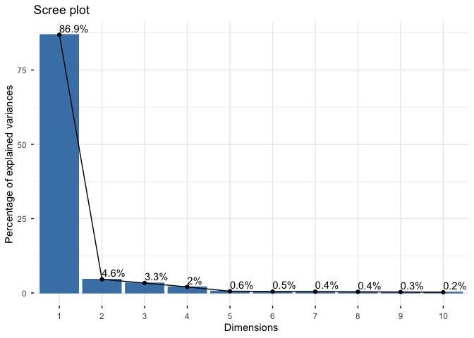
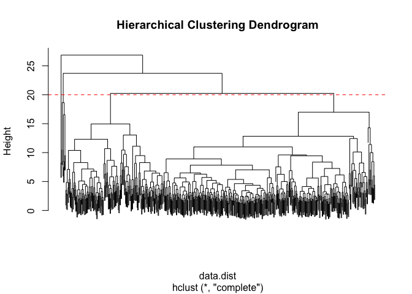
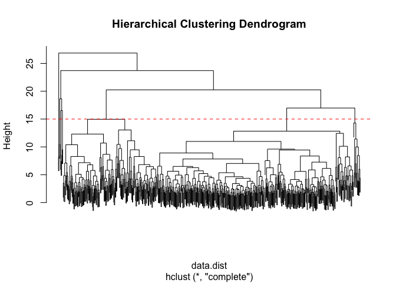
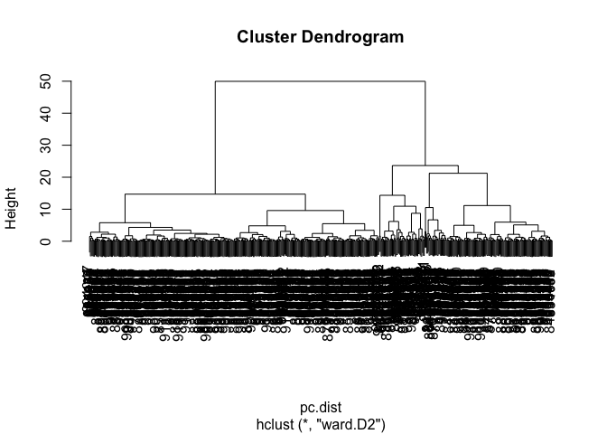
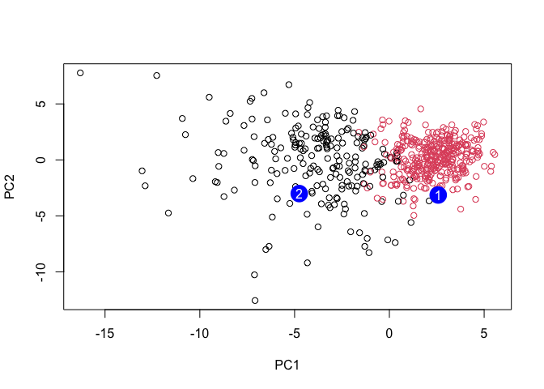

# Class8 Mini Project
Sahar kamali (PID:A19156624)

- [Preparing Data/ Exploratory data
  analysis](#preparing-data-exploratory-data-analysis)
- [Performing PCA and results](#performing-pca-and-results)
- [Variance explained](#variance-explained)
- [Hierarchical clustering and combining
  methods](#hierarchical-clustering-and-combining-methods)
- [Sensitivity/Specificity](#sensitivityspecificity)
- [Prediction/ Summary](#prediction-summary)

## Preparing Data/ Exploratory data analysis

``` r
fna.data <- "WisconsinCancer .csv"

# Read the CSV file into R
wisc.df <- read.csv(fna.data, row.names = 1)
```

``` r
# Pull out diagnosis column (M or B)
diagnosis <- wisc.df$diagnosis

# Create a features-only data frame (remove diagnosis column)
wisc.data <- wisc.df[, -1]
```

``` r
table(diagnosis)
```

    diagnosis
      B   M 
    357 212 

``` r
dim(wisc.data)
```

    [1] 569  30

``` r
# Perform PCA on the scaled data
wisc.pr <- prcomp(wisc.data, center = FALSE, scale. = TRUE)
```

``` r
summary(wisc.pr)
```

    Importance of components:
                             PC1     PC2     PC3     PC4     PC5     PC6     PC7
    Standard deviation     5.106 1.17163 1.00071 0.77971 0.42032 0.37458 0.36193
    Proportion of Variance 0.869 0.04576 0.03338 0.02026 0.00589 0.00468 0.00437
    Cumulative Proportion  0.869 0.91473 0.94811 0.96838 0.97427 0.97894 0.98331
                               PC8     PC9    PC10    PC11    PC12    PC13    PC14
    Standard deviation     0.33384 0.30895 0.26788 0.24897 0.18312 0.17587 0.13764
    Proportion of Variance 0.00372 0.00318 0.00239 0.00207 0.00112 0.00103 0.00063
    Cumulative Proportion  0.98703 0.99021 0.99260 0.99467 0.99578 0.99681 0.99745
                              PC15    PC16    PC17    PC18    PC19    PC20    PC21
    Standard deviation     0.12431 0.11152 0.10015 0.09198 0.08242 0.07441 0.06793
    Proportion of Variance 0.00052 0.00041 0.00033 0.00028 0.00023 0.00018 0.00015
    Cumulative Proportion  0.99796 0.99838 0.99871 0.99899 0.99922 0.99940 0.99956
                              PC22    PC23    PC24    PC25    PC26    PC27    PC28
    Standard deviation     0.06247 0.05446 0.04676 0.04060 0.03637 0.03206 0.01299
    Proportion of Variance 0.00013 0.00010 0.00007 0.00005 0.00004 0.00003 0.00001
    Cumulative Proportion  0.99969 0.99979 0.99986 0.99991 0.99996 0.99999 1.00000
                               PC29    PC30
    Standard deviation     0.009005 0.00289
    Proportion of Variance 0.000000 0.00000
    Cumulative Proportion  1.000000 1.00000

Questions:

``` r
# Q1: number of observations
nrow(wisc.data)
```

    [1] 569

``` r
# Q2: number of malignant observations
table(diagnosis)["M"]
```

      M 
    212 

``` r
# Q3: number of variables ending in "_mean"
length(grep("_mean$", colnames(wisc.data)))
```

    [1] 10

\###Q1. How many observations are in this dataset? 10 observations.

\###Q2. How many of the observations have a malignant diagnosis? 212
malignant diagnosis.

\###Q3. How many variables/features in the data are suffixed with
\_mean? 10 variables.

## Performing PCA and results

``` r
attributes(wisc.pr)
```

    $names
    [1] "sdev"     "rotation" "center"   "scale"    "x"       

    $class
    [1] "prcomp"

``` r
head(wisc.pr$x)
```

                   PC1        PC2          PC3         PC4        PC5          PC6
    842302   -8.523845 -2.6752000 -0.645114140 -0.06106455 -1.5149383  0.006804787
    842517   -5.464693 -0.9090903  1.236676888 -0.29437133  0.5494111 -0.724104473
    84300903 -7.000499 -1.5261194  0.000299764 -0.35760826 -0.1739704 -0.352037220
    84348301 -8.012519  0.6906317 -2.461471692 -0.93674762 -2.0569269  0.285265520
    84358402 -6.440893 -1.4559326  0.103423000  0.50894153  0.2503397 -0.818732575
    843786   -5.734696  0.2602019 -0.880502476 -1.04296350 -0.8070734  0.008002821
                     PC7         PC8         PC9        PC10          PC11
    842302    0.09305699 -0.35933810  0.03035265 -0.21100505 -0.3371887053
    842517    0.18720216  0.22999502  0.22023782 -0.10858913 -0.0306268463
    84300903 -0.25945896  0.11672952  0.34959934  0.14829326 -0.0251368356
    84348301 -0.11045709 -0.68791585  0.72025701 -0.08841812 -0.0002189302
    84358402 -0.50349824  0.17785497 -0.31204649 -0.30822519  0.0872950076
    843786   -0.10107539 -0.03068264 -0.22872849 -0.14000415 -0.1888493413
                     PC12        PC13        PC14         PC15         PC16
    842302   -0.163162469  0.24884116  0.07241574  0.265354669  0.092204961
    842517    0.289755505  0.29864523 -0.04147678 -0.024551831  0.009433075
    84300903  0.243949149 -0.08646449 -0.20723484 -0.016576499 -0.157481199
    84348301  0.440483031 -0.03967343 -0.15304518 -0.009060404  0.172100152
    84358402 -0.054011198  0.05036544  0.29083087 -0.098751943 -0.065247481
    843786    0.002564427  0.11027298 -0.03628880 -0.007761112 -0.006764704
                    PC17        PC18         PC19        PC20         PC21
    842302    0.12343109  0.01978360  0.200995217 -0.02682882  0.093344477
    842517    0.09107592 -0.01400678  0.056366828 -0.04511407  0.144747924
    84300903 -0.08329169 -0.01813770 -0.144480645 -0.10113941 -0.005923404
    84348301 -0.11917956 -0.11377244 -0.022731628 -0.22324747  0.008299749
    84358402  0.14836588 -0.06662622  0.001529034  0.02055087 -0.037587286
    843786   -0.05798966 -0.01005086 -0.054469307 -0.11207425 -0.061921920
                    PC22         PC23        PC24         PC25         PC26
    842302    0.11697087 -0.003432832  0.23214561 -0.003895143  0.044532762
    842517   -0.02802828 -0.033175319 -0.14129379  0.009995201 -0.023644497
    84300903  0.01128233 -0.022779829 -0.01480020 -0.063161510  0.001279657
    84348301  0.19909893  0.020583011 -0.12508352 -0.144898984  0.001388003
    84358402  0.02693134  0.038999280 -0.01849461  0.024163022  0.005033837
    843786   -0.01267007  0.027465940  0.04778646 -0.014848967 -0.018359011
                     PC27         PC28         PC29          PC30
    842302    0.020885755  0.012142357 -0.014196534 -1.142481e-02
    842517   -0.061642994 -0.009430978  0.004907952 -2.946812e-04
    84300903  0.021801791 -0.017871134  0.000050999 -2.448683e-05
    84348301 -0.025447895 -0.005366494  0.028447798 -4.640114e-03
    84358402 -0.013440406  0.009043595 -0.004627072  5.208533e-03
    843786   -0.003608653  0.002675786  0.007655592  9.325458e-04

Questions: \###Q4. From your results, what proportion of the original
variance is captured by the first principal component (PC1)? 44.3% of
the total variance or 0.4427

\###Q5. How many principal components (PCs) are required to describe at
least 70% of the original variance in the data? 3 principal components.
Cumulative variance after: PC1 = 44.27% PC2 = 63.24% PC3 = 72.64%

\###Q6. How many principal components (PCs) are required to describe at
least 90% of the original variance in the data? 7 principal components.
Cumulative variance after: PC6 = 88.76% PC7 = 91.01%

\###Q7.What stands out to you about this plot? Is it easy or difficult
to understand? Why? The biplot is difficult to interpret because it is
very cluttered and there are many overlapping points.

## Variance explained

``` r
library(ggplot2)
```

    Warning: package 'ggplot2' was built under R version 4.5.2

``` r
ggplot(as.data.frame(wisc.pr$x)) +
  aes(PC1, PC2, col = diagnosis) +
  geom_point()
```



``` r
library(ggplot2)

ggplot(as.data.frame(wisc.pr$x)) +
  aes(PC1, PC3, col = diagnosis) +
  geom_point()
```



\###Q8. Q8. Generate a similar plot for principal components 1 and 3.
What do you notice about these plots? In the PC1 vs PC3 plot, the two
groups still separate mostly along PC1. PC3 doesn’t add much extra
separation the benign and malignant points overlap a lot vertically so
the main pattern is basically the same as the PC1 vs PC2 plot.PC1 is
doing most of the work.

``` r
# Calculate variance of each component
pr.var <- wisc.pr$sdev^2
head(pr.var)
```

    [1] 26.0692375  1.3727267  1.0014220  0.6079399  0.1766726  0.1403120

``` r
# Variance explained by each principal component: pve
pve <- pr.var / sum(pr.var)

# Plot variance explained for each principal component
plot(c(1, pve),
     xlab = "Principal Component",
     ylab = "Proportion of Variance Explained",
     ylim = c(0, 1),
     type = "o")
```



``` r
# Alternative scree plot of the same data, note data driven y-axis
barplot(pve,
        ylab = "Percent of Variance Explained",
        names.arg = paste0("PC", 1:length(pve)),
        las = 2,
        axes = FALSE)

axis(2, at = pve, labels = round(pve, 2) * 100)
```



``` r
# OPTIONAL: PCA variance explained plot using factoextra
library(factoextra)
```

    Welcome! Want to learn more? See two factoextra-related books at https://goo.gl/ve3WBa

``` r
fviz_eig(wisc.pr, addlabels = TRUE)
```

    Warning in geom_bar(stat = "identity", fill = barfill, color = barcolor, :
    Ignoring empty aesthetic: `width`.



``` r
# Q9: PC1 loading for concave.points_mean
wisc.pr$rotation["concave.points_mean", 1]
```

    [1] -0.1792071

\###Q9. Q9. For the first principal component, what is the component of
the loading vector (i.e. wisc.pr\$rotation\[,1\]) for the feature
concave.points_mean? This tells us how much this original feature
contributes to the first PC. Are there any features with larger
contributions than this one? For PC1, the loading of concave.points_mean
is approximately −0.17, meaning this feature contributes to PC1 but is
not the strongest contributor. Other features have larger loadings and
therefore have a bigger influence on PC1.

Hierarchical clustering

``` r
# Check which features have the largest absolute PC1 loadings
pc1_loadings <- wisc.pr$rotation[, 1]

# Sort by absolute contribution
sort(abs(pc1_loadings), decreasing = TRUE)[1:10]
```

            perimeter_worst          perimeter_mean            radius_worst 
                  0.1921852               0.1921668               0.1917746 
                radius_mean        compactness_mean           symmetry_mean 
                  0.1917467               0.1897442               0.1897319 
            smoothness_mean fractal_dimension_worst        smoothness_worst 
                  0.1896978               0.1891863               0.1889369 
     fractal_dimension_mean 
                  0.1882517 

## Hierarchical clustering and combining methods

``` r
# Scale the wisc.data using the scale() function
data.scaled <- scale(wisc.data)
```

``` r
# Calculate Euclidean distances between observations
data.dist <- dist(data.scaled)
```

``` r
# Perform hierarchical clustering using complete linkage
wisc.hclust <- hclust(data.dist, method = "complete")
```

``` r
wisc.hclust.clusters<- cutree(wisc.hclust ,k=4) 
```

``` r
# Plot the hierarchical clustering dendrogram
plot(wisc.hclust, labels = FALSE, main = "Hierarchical Clustering Dendrogram")

# Add a horizontal line to indicate the cut height
abline(h = 20, col = "red", lty = 2)
```



``` r
# Plot the dendrogram
plot(wisc.hclust, labels = FALSE, main = "Hierarchical Clustering Dendrogram")

# Add a horizontal cut line (chosen to give 4 clusters)
abline(h = 15, col = "red", lty = 2)
```



``` r
# Cut the tree to get 4 clusters
pc.dist<-dist(wisc.pr$x[,1:3])
wisc.pr.hclust<-hclust(pc.dist, method="ward.D2")
plot(wisc.pr.hclust)
```



\###Q10. Using the plot() and abline() functions, what is the height at
which theclustering model has 4 clusters? From the dendrogram, the tree
is cut at a height of approximately 15 to produce 4 clusters, as
indicated by the horizontal red line where four main branches remain
separated.

\##Q11. OPTIONAL: Can you find a better cluster vs diagnoses match by
cutting into a different number of clusters between 2 and 6? How do you
judge the quality of your result in each case? Cluster 1 largely
corresponds to malignant (M) samples, while cluster 3 largely
corresponds to benign (B) samples, indicating that the hierarchical
clustering separates the two diagnoses reasonably well.

\###Q12.Which method gives your favorite results for the same data.dist
dataset? Explain your reasoning. Among the linkage methods tested,
ward.D2 gives the best results because it produces tighter, more
distinct clusters with better separation between benign and malignant
samples compared to single or complete linkage.

``` r
grps<-cutree(wisc.pr.hclust, k=2)
table(grps)
```

    grps
      1   2 
    213 356 

``` r
table(grps,diagnosis)
```

        diagnosis
    grps   B   M
       1  31 182
       2 326  30

``` r
wisc.hclust.clusters <- cutree(wisc.hclust, k = 4)
```

``` r
# Compare cluster assignments to diagnosis
table(wisc.hclust.clusters, diagnosis)
```

                        diagnosis
    wisc.hclust.clusters   B   M
                       1  12 165
                       2   2   5
                       3 343  40
                       4   0   2

``` r
# Compare different linkage methods


for (m in 2:6) {
  cat("\n====================\n")
  cat("Linkage method:", m, "\n")
  
  hc <- hclust(data.dist, method = "ward.D2")
  clusters <- cutree(hc, k = m)
  
  print(table(clusters, diagnosis))
}
```


    ====================
    Linkage method: 2 
            diagnosis
    clusters   B   M
           1  20 164
           2 337  48

    ====================
    Linkage method: 3 
            diagnosis
    clusters   B   M
           1   0 115
           2  20  49
           3 337  48

    ====================
    Linkage method: 4 
            diagnosis
    clusters   B   M
           1   0 115
           2   6  48
           3 337  48
           4  14   1

    ====================
    Linkage method: 5 
            diagnosis
    clusters   B   M
           1   0  59
           2   0  56
           3   6  48
           4 337  48
           5  14   1

    ====================
    Linkage method: 6 
            diagnosis
    clusters   B   M
           1   0  59
           2   0  56
           3   6  48
           4 235  46
           5 102   2
           6  14   1

``` r
 hc <- hclust(data.dist, method = "single")
  clusters <- cutree(hc, k = 2)
  
  print(table(clusters, diagnosis))
```

            diagnosis
    clusters   B   M
           1 357 210
           2   0   2

``` r
 hc <- hclust(data.dist, method = "complete")
  clusters <- cutree(hc, k = 2)
  
  print(table(clusters, diagnosis))
```

            diagnosis
    clusters   B   M
           1 357 210
           2   0   2

``` r
 hc <- hclust(data.dist, method = "average")
  clusters <- cutree(hc, k = 2)
  
  print(table(clusters, diagnosis))
```

            diagnosis
    clusters   B   M
           1 357 209
           2   0   3

``` r
## Use the distance along the first 7 PCs for clustering i.e. wisc.pr$x[, 1:7]
wisc.pr.hclust <- hclust(dist(wisc.pr$x[, 1:3]), method = "ward.D2")
```

``` r
## Cut this hierarchical clustering model into 2 clusters
wisc.pr.hclust.clusters <- cutree(wisc.pr.hclust, k = 2)

## Check cluster sizes
table(wisc.pr.hclust.clusters)
```

    wisc.pr.hclust.clusters
      1   2 
    213 356 

``` r
## Compare PCA-based clusters to actual diagnoses
table(wisc.pr.hclust.clusters, diagnosis)
```

                           diagnosis
    wisc.pr.hclust.clusters   B   M
                          1  31 182
                          2 326  30

``` r
grps <- cutree(wisc.pr.hclust, k=2)
table(grps)
```

    grps
      1   2 
    213 356 

## Sensitivity/Specificity

I can run `table()` with both my clustering `grps` and the expert
`diagnosis`

``` r
table(grps, diagnosis)
```

        diagnosis
    grps   B   M
       1  31 182
       2 326  30

our cluster “1” has 179 “M” diagnosis our cluster “2” has 333 “B”
diagnosis

179 TP 24 FP 333 TN 33 FN

Sensitivity: TP/(TP+FN)

``` r
179/(179+33)
```

    [1] 0.8443396

Specificity: TN/(TN+FP)

``` r
333/(333+24)
```

    [1] 0.9327731

\###Q13. How well does the newly created hclust model with two clusters
separate out the two “M” and “B” diagnoses? The two-cluster model
separates the diagnoses fairly well. One cluster contains mostly
malignant samples, while the other contains mostly benign samples, with
only a small number of samples misclassified in each group. Overall,
this shows strong separation between M and B using two clusters.

\###Q14. How well do the hierarchical clustering models you created in
the previous sections (i.e. without first doing PCA) do in terms of
separating the diagnoses? Again, use the table() function to compare the
output of each model (wisc.hclust.clusters and wisc.pr.hclust.clusters)
with the vector containing the actual diagnoses. The hierarchical
clustering model with PCA performs better than the model without PCA.
Using PCA first leads to cleaner separation between malignant and benign
samples, while clustering on the original scaled data produces more
mixed clusters. Overall, PCA improves the clustering results.

``` r
table(wisc.hclust.clusters, diagnosis)
```

                        diagnosis
    wisc.hclust.clusters   B   M
                       1  12 165
                       2   2   5
                       3 343  40
                       4   0   2

## Prediction/ Summary

``` r
#url <- "new_samples.csv"
wisc.pr<-prcomp(wisc.data, scale=T)
url <- "https://tinyurl.com/new-samples-CSV"
new <- read.csv(url)
npc <- stats::predict(wisc.pr, newdata=new)
npc
```

               PC1       PC2        PC3        PC4       PC5        PC6        PC7
    [1,]  2.576616 -3.135913  1.3990492 -0.7631950  2.781648 -0.8150185 -0.3959098
    [2,] -4.754928 -3.009033 -0.1660946 -0.6052952 -1.140698 -1.2189945  0.8193031
                PC8       PC9       PC10      PC11      PC12      PC13     PC14
    [1,] -0.2307350 0.1029569 -0.9272861 0.3411457  0.375921 0.1610764 1.187882
    [2,] -0.3307423 0.5281896 -0.4855301 0.7173233 -1.185917 0.5893856 0.303029
              PC15       PC16        PC17        PC18        PC19       PC20
    [1,] 0.3216974 -0.1743616 -0.07875393 -0.11207028 -0.08802955 -0.2495216
    [2,] 0.1299153  0.1448061 -0.40509706  0.06565549  0.25591230 -0.4289500
               PC21       PC22       PC23       PC24        PC25         PC26
    [1,]  0.1228233 0.09358453 0.08347651  0.1223396  0.02124121  0.078884581
    [2,] -0.1224776 0.01732146 0.06316631 -0.2338618 -0.20755948 -0.009833238
                 PC27        PC28         PC29         PC30
    [1,]  0.220199544 -0.02946023 -0.015620933  0.005269029
    [2,] -0.001134152  0.09638361  0.002795349 -0.019015820

``` r
plot(wisc.pr$x[,1:2], col=grps)
points(npc[,1], npc[,2], col="blue", pch=16, cex=3)
text(npc[,1], npc[,2], c(1,2), col="white")
```



\###Q16. Which of these new patients should we prioritize for follow up
based on your results? Patient 2 should be prioritized for follow up
because it falls closer to the cluster dominated by malignant samples in
the PCA plot. Patient 1 is located closer to the benign cluster and
appears less concerning by comparison.
