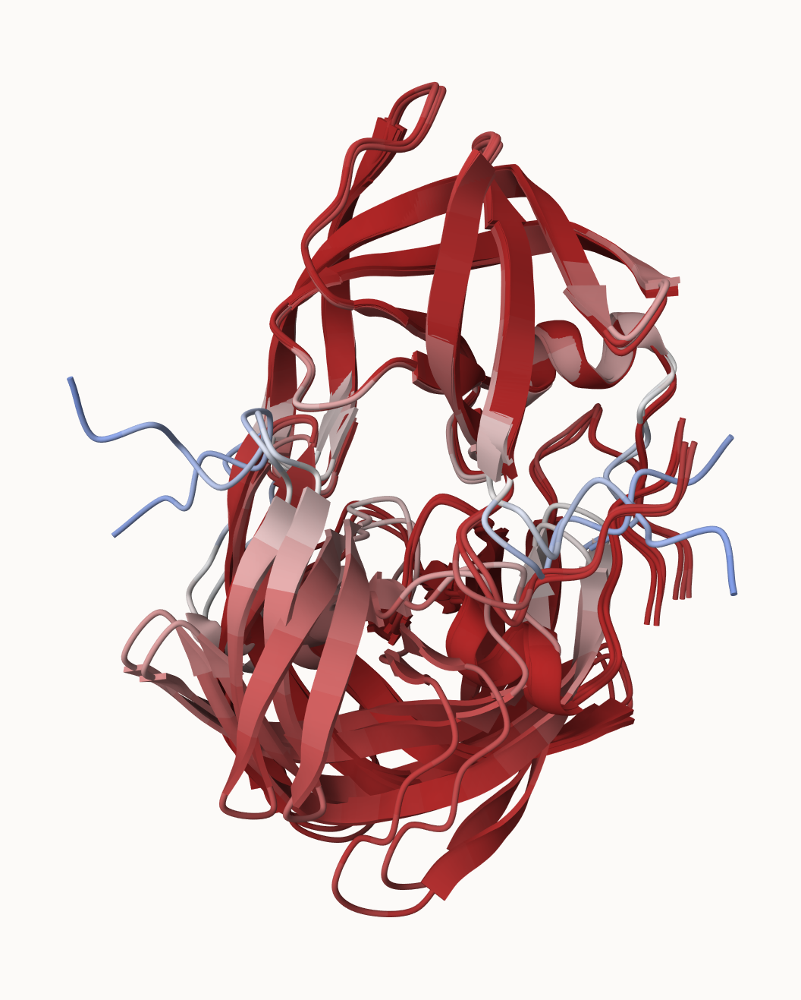
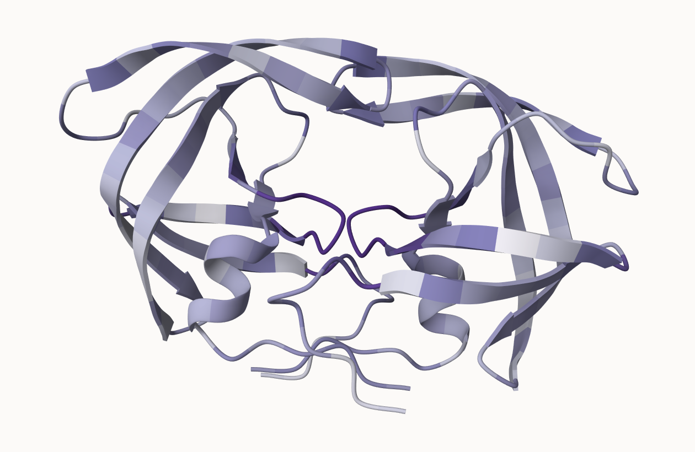

## The EBI Alphafold database 

the EBI alphafold database contains lots of cmpured strucutres models. It is increaslilgy likely that the strcuture you are intrestee in is already in database at < https://alphafold.ebi.ac.uk > 

there are three major outputs from Alphafold 

1. A model of strcuture in **PDB** format. 
2. A **pLDDT** score: that tells us how confident the model is for a given residue in your protein (High values are good, above70 ). 
3. A **PAE** score taht tell us about protein packing quality 

If you cant find a matching entry for the sequence you are intrested in AFDB you can run AlphaFold yourself... 

## Running AlphaFold 

we will use ColabFold to run AlphaFold on our sequence < https://github.com/sokrypton/ColabFold > 

## Inerpreting Results 

Custom analysis of resulting models 

we can read all the AphaFold results into R and do more quanitative analysis than just viewing the structure in Mol-star: 

The PDB database (the main respositriy of experiment strcuture) only has ~250 thousand structures (we saw this in the last lab). The main sequence database has over **200 million** sequneces! only 0.125% of known sequences have a known a structure - this is called the "strcuture knowledge gap". 
```{r}
(250000 / 200000000)*100
```
Structures are much harder to determine than sequences they are expensive on avregae (about $1 million dollars each) they take on avrega 2-5 years to solveThe 
EBI has a database of pre-computed AlphFold (AF) models called AFDB. This is growing over time and it is useful to check before running AF ourselves. 

Read all the PBD models: 
```{r}
library(bio3d)
p<- read.pdb("hivpr_23119/hivpr_23119_unrelaxed_rank_001_alphafold2_multimer_v3_model_4_seed_000.pdb")
```

```{r}
results_dir <- "hivpr_23119/"

```

```{r}
pdb_files <- list.files(path=results_dir,
                        pattern="*.pdb",
                        full.names = TRUE)

# Print our PDB file names
basename(pdb_files)
```

```{r}
library(bio3d)

# Read all data from Models 
#  and superpose/fit coords
pdbs <- pdbaln(pdb_files, fit=TRUE, exefile="msa")
```
```{r}

```


```{r}
rd <- rmsd(pdbs, fit=T)

range(rd)
```
```{r}
library(pheatmap)

colnames(rd) <- paste0("m",1:5)
rownames(rd) <- paste0("m",1:5)
pheatmap(rd)
```

```{r}
# Read a reference PDB structure
pdb <- read.pdb("1hsg")
```

```{r}
plotb3(pdbs$b[1,], typ="l", lwd=2, sse=pdb)
points(pdbs$b[2,], typ="l", col="red")
points(pdbs$b[3,], typ="l", col="blue")
points(pdbs$b[4,], typ="l", col="darkgreen")
points(pdbs$b[5,], typ="l", col="orange")
abline(v=100, col="gray")
```


```{r}
core <- core.find(pdbs)
```


```{r}
core.inds <- print(core, vol=0.5)
```

```{r}
xyz <- pdbfit(pdbs, core.inds, outpath="corefit_structures")
```


```{r}
rf <- rmsf(xyz)

plotb3(rf, sse=pdb)
abline(v=100, col="gray", ylab="RMSF")
```

```{r}
library(jsonlite)

# Listing of all PAE JSON files
pae_files <- list.files(path=results_dir,
                        pattern=".*model.*\\.json",
                        full.names = TRUE)
```


```{r}
pae1 <- read_json(pae_files[1],simplifyVector = TRUE)
pae5 <- read_json(pae_files[5],simplifyVector = TRUE)

attributes(pae1)
```

```{r}
# Per-residue pLDDT scores 
#  same as B-factor of PDB..
head(pae1$plddt) 
```

```{r}
pae1$max_pae
```

```{r}
pae5$max_pae
```

```{r}
plot.dmat(pae1$pae, 
          xlab="Residue Position (i)",
          ylab="Residue Position (j)")
```


```{r}
plot.dmat(pae5$pae, 
          xlab="Residue Position (i)",
          ylab="Residue Position (j)",
          grid.col = "black",
          zlim=c(0,30))
```

```{r}
plot.dmat(pae1$pae, 
          xlab="Residue Position (i)",
          ylab="Residue Position (j)",
          grid.col = "black",
          zlim=c(0,30))
```

```{r}
aln_file <- list.files(path=results_dir,
                       pattern=".a3m$",
                        full.names = TRUE)
aln_file
```


```{r}
aln <- read.fasta(aln_file[1], to.upper = TRUE)
```


```{r}
dim(aln$ali)
```


```{r}
sim <- conserv(aln)

plotb3(sim[1:99], sse=trim.pdb(pdb, chain="A"),
       ylab="Conservation Score")
```


```{r}
con <- consensus(aln, cutoff = 0.9)
con$seq
```
```{r}
m1.pdb <- read.pdb(pdb_files[1])
occ <- vec2resno(c(sim[1:99], sim[1:99]), m1.pdb$atom$resno)
write.pdb(m1.pdb, o=occ, file="m1_conserv.pdb")
```


```{r}

```


